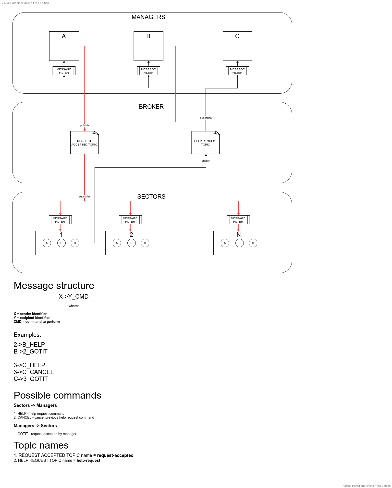

# Signalling

Desktop application which handle bidirectional communication 
with simple hardware using MQTT protocol frequently used in IoT systems.

It's just example of communication

### Modules
* Sectors - module contains models which imitates hardware
* Sector Manager - Desktop app

App was tested with real hardware

### Overview diagram

### Dev info
* Java8
* Gradle